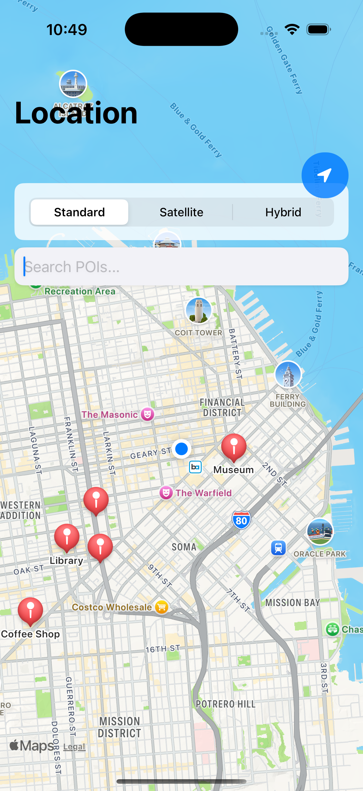
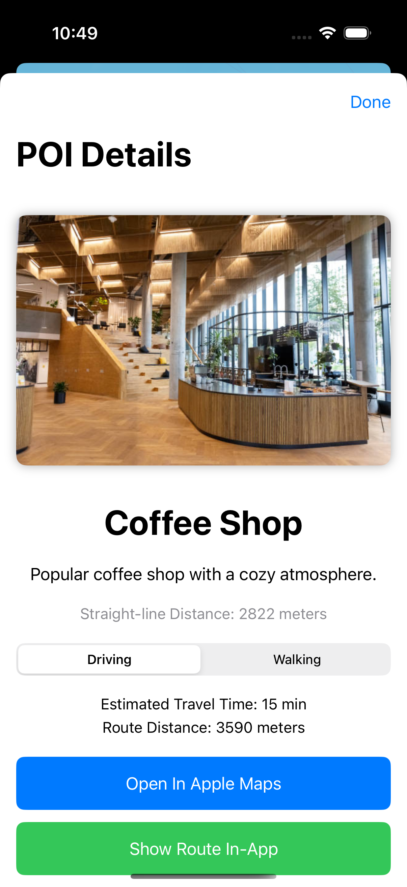
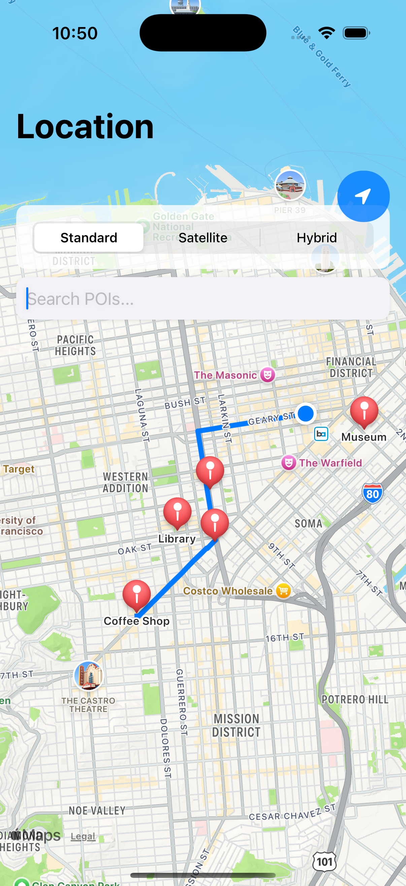

Location – iOS Assignment

This is a SwiftUI-based iOS app that uses CoreLocation and MapKit to track the user’s location and show points of interest (POIs) on an interactive map. It was built for the Location Services and Maps assignment.

---

Installation Instructions:

1. Open `Location` in Xcode (version 14 or higher recommended).
2. Choose a simulator or a real device.
3. Press Cmd + R or hit the Run button to launch the app.
4. When prompted, make sure to allow location access.
5. Add the following images to your Assets folder before running:
   - coffee
   - museum
   - historic
   - library
   - park

(These match the imageName values used for POIs.)

---

Features:

- Live user location tracking on map.
- MapKit support with standard, satellite, and hybrid views.
- 5 sample POIs with name, description, image, and category.
- Search bar to filter POIs in real time.
- Custom annotation pins that open detail views when tapped.
- Calculates straight-line distance and estimated travel time (Driving/Walking).
- Option to open Apple Maps or view directions within the app.
- Smooth animations and transitions between views.
- Supports both portrait and landscape orientations.
- Alerts and loading states for smoother experience.

---

Screenshots:

## Screenshots

**Map View Standard**       

**Map View Satellite**       

**Map View hybrid**       

**POI Detail View**  

**Directions**  

---

Third-Party Libraries:

None. The app only uses built-in Apple frameworks:
- SwiftUI
- MapKit
- CoreLocation

---

Known Issues / Notes:

- If you see “kCLErrorDomain error 0” on launch, it usually resolves quickly. This is expected in the Simulator.
- Transit directions are not included.
- POIs are hardcoded in the app; no backend or API is used.
- Make sure the asset names match the POI image names exactly.

---

Submitted as part of the iOS assignment on Location Services.

